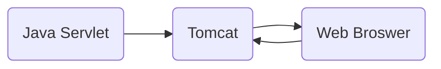


# Template of Assignment 1

## What is Included in the Template

- A Working Web Application which is a "simple todo list" (😎 Don't worry, it's working)

- Very simple user login and signup logic

- Basic CRUD operations (Create, Read, Update, and Delete)

## Intro to the architecture

Web Application



Backend

- Java 1.7

- javax.servlet-api 4.0.0

- Tomcat 7

- Maven

  

Frontend

- HTML, CSS, JS

- Bootstrap 3.0.0 for CSS styling

  

## Step-by-step Environment Setup Guide

  

The following guide is base on **CentOS 7** machine. (Kernel Version x86_64 Linux 3.10.0-1062.9.1.el7.x86_64)

  

### Install Java 7

```bash

$ sudo yum install java-1.7.0-openjdk-devel

```

Warning Again : If you are on a different linux distribution other than **CentOS**, you may have to use a different approach for every step.

  

By the way, to check the version of your default Java, run this command:

```bash

$ java --version

```

If you have different Java version installed locally, you may want to use **alternative** command.

```bash

sudo alternatives --config java

```

Here is an example of the output:

```

There are 5 programs which provide 'java'.

  

Selection Command

-----------------------------------------------

1 java-1.7.0-openjdk.x86_64 (/usr/lib/jvm/java-1.7.0-openjdk-1.7.0.161-2.6.12.0.el7_4.x86_64/jre/bin/java)

2 java-1.8.0-openjdk.x86_64 (/usr/lib/jvm/java-1.8.0-openjdk-1.8.0.151-5.b12.el7_4.x86_64/jre/bin/java)

  
  

Enter to keep the current selection[+], or type selection number:

```

### Install Maven

```bash

$ sudo yum install maven

```

Verify the installation

```bash

$ mvn -version

```

Output:

```

Apache Maven 3.0.5 (Red Hat 3.0.5-17)

Maven home: /usr/share/maven

Java version: 1.7.0_241, vendor: Oracle Corporation

Java home: /usr/lib/jvm/java-1.7.0-openjdk-1.7.0.241-2.6.20.0.el7_7.x86_64/jre

Default locale: en_US, platform encoding: UTF-8

OS name: "linux", version: "3.10.0-1062.9.1.el7.x86_64", arch: "amd64", family: "unix"

```

### Install and Configure MySQL

```bash

$ sudo yum localinstall https://dev.mysql.com/get/mysql80-community-release-el7-1.noarch.rpm

$ sudo yum install mysql-community-server

```

**Starting MySQL**

  

Once the installation is completed, start the MySQL service and enable it to automatically start on boot with:

```bash

$ sudo systemctl enable mysqld

$ sudo systemctl start mysqld

```

We can check the MySQL service status by typing:

```bash

sudo systemctl status mysqld

```

Output

```

● mysqld.service - MySQL Server

Loaded: loaded (/usr/lib/systemd/system/mysqld.service; enabled; vendor preset: disabled)

Active: active (running) since Wed 2018-05-23 11:02:43 UTC; 14min ago

Docs: man:mysqld(8)

http://dev.mysql.com/doc/refman/en/using-systemd.html

Process: 4293 ExecStartPre=/usr/bin/mysqld_pre_systemd (code=exited, status=0/SUCCESS)

Main PID: 4310 (mysqld)

Status: "SERVER_OPERATING"

CGroup: /system.slice/mysqld.service

└─4310 /usr/sbin/mysqld

```

**Securing MySQL**

  

Get the auto-generated password

```bash

$ sudo grep 'temporary password' /var/log/mysqld.log

```

Output

```

A temporary password is generated for root@localhost: q&0)V!?fjksL

```

Run the `mysql_secure_installation` command to improve the security of our MySQL installation:

```bash

$ sudo mysql_secure_installation

```

The script will also ask you to remove the anonymous user, restrict root user access to the local machine and remove the test database. You should answer “Y” (yes) to all questions.

  

**Connecting to MySQL from the command line**

  

To log in to the MySQL server as the root user type:

```bash

mysql -u root -p

```

**Create a Database**

  

Once you are connected to the MySQL shell, you can create a new database by typing the following command:

```sql

CREATE  DATABASE list;

```

**Create a Table**

  

You don't have to create a table yourself. The Java servlet application will create it for you on the fly when it is running.

  

**Create a MySQL User**

```sql

CREATE USER 'boss'@'localhost' IDENTIFIED BY  'AAAAAbbbbb888;8';

GRANT ALL PRIVILEGES ON list.*  TO  'boss'@'localhost';

ALTER USER 'boss'@'localhost' IDENTIFIED WITH mysql_native_password BY  'AAAAAbbbbb888;8';

FLUSH PRIVILEGES;

```

Make sure you copy-paste the above commands. They are very important.

  

## Run the Application

cd into the project template folder

```bash

$ mvn tomcat:run

```

  

Go to you web browser, navigate to `ip-of-your-server:8080\my-webapp`

If you host the service on local machine, go to `localhost:8080\my-webapp`

  

You can register an account and login to see if everything is right.

  


  

Authors

: Enkai Ji
